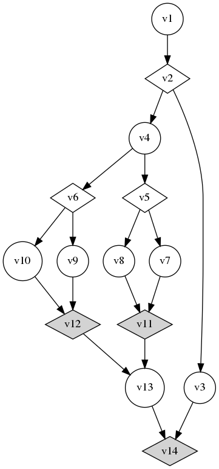

# Code generator description 

This package is responsible for generating the task and subtasks code
for a given task system under a heterogeneous platform. First, we
assume that all alternative choices have been made in the real-time
optimization and testing phase. Therefore, the task generation does
not consider tasks with **alternative** nodes.  We introduce our code
generator using the example disclosed in the following figure: 


<div style="text-align:center"></div>


Mainly three files are generated: **main.cpp**, **tasks.cpp** and
**tasks.hpp**. The correctness and the deadlock avoidance are granteed
by the acylic nature of the input graph. If the user tends to call
other, non called kernel, he has to ensure him self, that no deadlock
can occur.


## Subtask code generation

Each sub-task is implemented using a thread. If we consider
multiperiodic task sets (communicating tasks may have different
periods), each thread is periodic it self. However, if all subtasks of
the same task share the same period, threads periodicity is ensured by
the task thread. 

For example the prototype of task **v13** is declared in the file
**tasks.h** whereas its body is described in **tasks.c** as the following

```c

void * v13(); // tasks.h
```
```c
void * v13(){ // tasks.c
  ...
}
```

Further,  for each task we generate two parts : The initialization part, and the
periodic part.


### The generation of subtask init code

The task initialization step has the goal to init the different
variables, scheduler parameters, ... to proprely execute the subtask.

For the task **v13** starts its subtask init code by setting its
affinity is partitioned scheduling is considered. Therefore, the CPU
set takes in its first parameter **1** as the **v13** is meant to be
allcoated on the core indexed by **1**.  We check if the subtask
affinity has been succefull achieved, otherwise the subtask is
dropped. The init code for subtask **v13** is presented in the
following listing:

```c
  int s; 
  cpu_set_t cpuset;
  pthread_t thread;
  thread = pthread_self();
  CPU_ZERO(&cpuset);
  CPU_SET(1, &cpuset);
  s = pthread_setaffinity_np(thread, sizeof(cpu_set_t), &cpuset);
  if (s != 0){ 
    printf(" Allocation Error: Unable to allocatev13 to computing unit 1, exiting \n ");
    exit(-1); 
  } 
``` 

### The generation of subtask  looped code

As any real-time task has to be repetive, the subtask code is nested
inside a **while** loop. Therefore the task looping code is inserted
just after the subtask init code. The body of the loop task depend of
the subtask type as disclosed in the rest of this discription.

```c
  while(1) {
    ....
  }
```
 


### Compute Node "COMPUTE"


In the case of a **COMPUTE** task, the subtask code is simple to 
generate. The task has to wait for all its predecessors. Therefore,  
each link between the task and its predecessors is translated by a
semaphore generation. The semaphore variable is global, therefore any
node within the same task may access, acquire and free the
semaphore. However, only the concerned subtasks are calling
**sem_wait** and **sema_post** primitives. Similarly, a compute
subtask generates a semaphore between it and each of its
sucessors. For its predecessor a subtask calls **sema_wait** primitive
and calls the **sema_post** for its successors. By convention and to
avoid redeclaring the same semaphores, each semaphore variable name is
compound by **src_dst_sem** where **src** is the label of the source
subtask, **dst** for destination subtask. Between the both semaphore
groups the user may insert its subtask code (processings).


```c
	sem_wait(&v11_v13_sem);
    sem_wait(&v12_v13_sem);

    // Please insert Sub-task   v13   code here
    printf("  v13  \n");

    sem_post(&v13_v14_sem);
```	
	

### Conditional Nodes  "CONDITION"

First, we highlight that for each CONDITION node, it exists a
CCONDTION node.  Conditional nodes are a special. In fact they do not
achieve computation itself, but they act like a synchronization points
to all its predecessors. Therefore a **sema_wait** is called in a
similar way as a COMPUTE node. However, for its sucessors, it does not
free them all as in a COMPUTE subtask but only one of its two
sucessors is released according to a given condition. The condition
name is generated as the subtask label contatenated with *_c*. For
example for subtask **v6**, its condition variable name is
**v6_c**. The condition is evaluated online. For sake of emulation, we
update the condition by generating a random number between -10 and 10
in the following example.

```c
  while(1) {

    sem_wait(&v4_v6_sem);

    v6_c=random_between(-10,10);

 
    if (v6_c>0) { 
      sem_post(&v6_v9_sem);
  }
    else{ 
      sem_post(&v6_v10_sem);
  }
    sem_post(&v6_closing_sem); 
   }
```

When the condition is closed, only one of its sucessors will notify
its suceesors so the task can continues its execution. Therefore, for
each condition, we have a closing node that aims to wait for the
correct semaphore that have been signaled. This node has a type
**CCONDITION**. A node of a CCONDITION is blocked waiting for the
update of the condition. The following code shows the source code of
the **CCONDITION** for node **v6** (which is **v12** according to the
task example showed in the Figure above.).


```c
  while(1) {

  sem_wait(&v6_closing_sem);
  if (v6_c>0)
    sem_wait(&v9_v12_sem);
  else {
    sem_wait(&v10_v12_sem); 
  } 
    sem_post(&v12_v13_sem);
  }
```

Notice that the CCONDITION node first waits to be freed from
v_6. Further, according to the value of the condition, it will either
wait for the correct semaphore. If a CCONDITION node have several
predecessors of from the same successor of its CONDITION node, a dummy
node must be created to avoid liberating the CCONDITION Node only
after the first semaphore hit. This constraint will be removed soon.

### BUFFERS generation 


Two tasks or more may read/write the same data structures. If the
shared buffers are explicitly mentionned, there read/write operations
and accesses are generated by our code generator.


For example, we define here a communication between **v1** and **v2**
of a buffer called **buff** compound of 10 int elements. Buffers are
declared as gloval variables as well as their protection semaphores if
they are defined.


The communication between **v1** and **v2** source code is generated as follows: 


```c
    pthread_mutex_lock(&buff_1_mutex); 
    move_data(buff_1, sizeof(int)*10);  /* read operation */ 
    pthread_mutex_unlock(&buff_1_mutex); 
```

We highlight that this code is for a protected buffer (semaphores are
also genrated).

The read buffer code is inserted after the wait for predecessors
semaphores instructions, and the write buffers code is inserted before
posting (freeing) the successors buffers. Therefore our model supports
natively, AER execution model.


### GPU Kernels and Memcopies 


First, we highlight that our code generator for the GPU kernels
supports for the moment only CUDA. CUDA kernels can not be implemented
in a similar way as CPU threads. In fact, CUDA dissallows sleeping
tasks to increase throughput, therefore the gpu kernels are called
inside periodic CPU threads. Our code generator allows also to
generate the source code for the GPU kernel and its related calls for
other GPU Kernels if needed. 

As logical GPU and CPU memories are separated, memory copies are
needed when the memory used on the GPU is not *managed*, nor
*spinned*. In such case, they need to be explicitly defined as
**memcopy** operations that are executed within the **mem_cpy**
engines as any other COMPUTE kernel. The memory copies are 

## Task code generation 

The task code is at its turn devided between initialization part and
the reccurrent part. The initialization part is in charge to
initialize all semaphores and lunching threads within the same
task. As in the following example : 

```c
  struct periodic_data_struct *ps = (struct periodic_data_struct *) arg;
  sem_init(&v11_v13_sem, 0, 0); 
  sem_init(&v12_v13_sem, 0, 0); 
 
  .... 
  pthread_mutex_init(&buff_1_mutex, NULL); 
  ....

 // creating threads of tasks 
  pthread_create(&v14_tid, NULL, v14,  NULL);
  pthread_create(&v13_tid, NULL, v13,  NULL);
 .....
 ```
 
The second step is the reccurent task behavior initialization. Here
the implementation can be either periodic (as in the following
example), or triggered by an event. 


Therefore when the wakeup event/time is up, the source subtasks are
freed by signaling their semaphores. And the task waits to be freed by
the sink subtasks. and the task must be sleep, until the task can be
activable by using **clock_nanosleep** as in the following example.


```c
  struct timespec next;
  // Synchronize all tasks  here 
   while(1) {

    clock_gettime(CLOCK_REALTIME, &next);

    // signaling the  source threads to start 
    sem_post(&ent_v1_sem);   

    // Waiting for all threads to complete 
    sem_wait(&ext_v14_sem);   

    timespec_add_us(&next, ps->period_us);
    clock_nanosleep(CLOCK_REALTIME, TIMER_ABSTIME, &next, NULL);
  }
```
