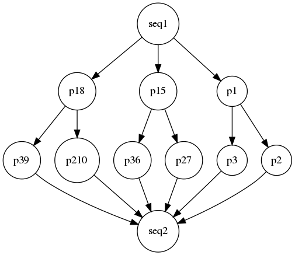
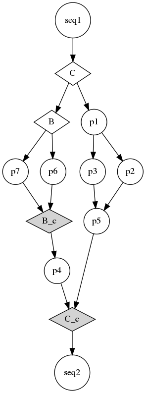
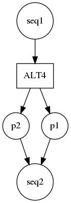

# HPC-DAG Grammar:
Auteur : Houssam-Eddine Zahaf


This part of the HPC DAG Analyzer aims to provide a grammar to
describe the hardware architecture and the software stack using the
HPC DAG Model. Please, first overview the architecture and ssytem mode
section of paper authored by Zahaf et el. entitled : **"The HPC DAG
task Model for heterogeneous real-time system"**.

## The hardware description : 
## The software description :


We introduce the different features of our langage by example. 


### Simple example : LL Task model 

First let define a Liu and LayLand task. Therefore the task is a
executed using a single thread, characterized by :

- **C:**  The task worst case execution time 
- **D:**  The task deadline
- **T:**  The task period, the time duration between to activations of the same 
- **PC:** The task preemtion cost, which is the cost to account, if this task is preempted


Each task definition is considered as a Graph, task **tau** can be defined as follows:

```c
Graph tau(T=50,D=40);	
```


In this example, we define task tau, with a period of 50ms, and a deadline of 40ms.  
To define the task execution time, and preemption cost we define *Compute Nodes* as follows : 

```c
Node dd(C=4);
``` 

In the example above, we defined a compute Node **dd** having an
execution time that is equal to 4ms. To assign this node to the task
**tau**, the relation has to be defined as follows: 

```c
tau={dd;};
``` 

This is equivalent of defining a periodic Liu and Layland task, having
a period of 50 ms, a deadline of 40 ms, and worst case execution time
of 4 ms.

Further, the preemption cost may be defined using the tokken *PC* in
the node declaration, as well as the task TAG is a heterogeneous
architecture is considered. For example:

```c
Node dd(C=4, PC=3, TAG=GPU,"TT"="BB");
``` 

defines that node **dd** has a preemption cost of 3 ms and can only
execute within a GPU node. If **PC** is not explicitly mentioned, it
is considered as equal to **0**. If the **TAG** is not specified, it
is considered as the default **TAG**. The user may define extra
parameters to a given subtask so it can be used for
extra-functionalities that are not provided by the current version of
the tool. In contrast to the other optional properties, he execution
time property is mondatory, and an error is generated and compilation
will be aborted if not available.

The full example can be found in *examples/simple_1.c*.

### A parallel task example using directed acyclic graphs (examples/fork_join.c)

The user may want to express parallelization and more complex
execution patterns than those of LL model. Here we provide a new
example.


Let tau be a task compound of a sequential thread **seq1**, two
parallel threads **p1** and **p2** to join back a sequential thread
**seq2** as described in the following Figure 


<!--  -->

<div style="text-align:center"></div>

Such a graph can be described using our grammar as following: 


```c++
Tag CPU, GPU;
Node seq1(C=4, TAG=CPU);
Node p1(C=4,PC=3,TAG=GPU);
Node p2(C=2, TAG=CPU);
Node seq2(C=1, TAG=CPU);

Graph tau(T=50,D=40);

tau={
  seq1;
  par(p1,p2);
  seq2;
};

generate(tau,"/tmp/gr.dot");
``` 

Let now explain each line of the above listing. The first Line is
similar to the Tags described in Hardware modeling section. Further,
we describe each thread/functionality as in the previous example.
Further, we describe the task behavior and composition, therefore the
subtasks are ordered according to their appearance/calling order in
the task structure description block. Thus, the graph **tau** starts
by seq1. Further, we find the primitive **par**, therefore all nodes
between the parenthesis after par are supposed to be executed in
parallel. Therefore, **p1** and **p2** can be executed in parallel
after **seq1** has finished its execution. At the end of the execution
of both **p1** and **p2**, the execution continues onward by executing
*seq2*. **par** operation is not only binary, it can take several
nodes (more than one).

After the task declaration block, the **generate** primitive allows to
 visualize the graph structure of task **tau**, and print it in
 "/tmp/gr.dot" in **GraphViz** (dot) format.
 
 

the full example can be found in the examples folder under the name
*examples/fork_join.c*.
 
 
  
### Repetitive graph structures : sDraph-s and copies

 Usually in a complex real-time task, such as those found in
 autonomous driving, several functionalities are used at different
 places in the software design. Our grammar provides the necessary
 tools for such repetitive software modules, by the mean of
 **sGraph**s.
 
 An **sGraph** is a software module (combination of nodes) that may be
 repeated at several places. It is defined in a similar way as a task
 (Graph). Therefore, it uses all structure definition primitives and
 mechanisms. However, it does not have a period, nor a deadline.
 
A software module can be reused using **copy** operation. A **copy**
operation allows copying the same sub graph structure between two or
more subgraphs. The first operad (**sGraph**) should be the source
subgraphs, and all the rest **sGraphs**s are destination
nodes. Further, each subgraph can be used in the same, or in different
tasks. Here is an example of the use of token **sGraph** and **copy**.

```c++
Tag CPU, GPU;
Node seq1(C=4, TAG=CPU);
Node p1(C=3,PC=3,TAG=GPU);
Node p2(C=2, TAG=CPU);
Node p3(C=1, TAG=CPU);

Node seq2(C=1, TAG=CPU);

sGraph s1, s2, s3;

s1={
  p1;
  par(p2,p3);
};

copy(s1,s2);
copy(s1,s3);
Graph tau(T=50,D=40);

tau={
  seq1;
  par(s1,s2,s3);
  seq2;
};

generate(tau,"/tmp/gr.dot");
```

In the example above, we first define three nodes **p1**, **p2** and
**p3**. Further, we define $s1$ as floows: **p1** than parallel
section compound of **p2** and **p3**. Further, we copy **s1** to
**s2** and to **s3**. Therefore, **s2** and **s3** have the same
structure as **s1**: the same number of nodes and the same edges
between nodes (**s1** and **s2** are isomorphe graphs). Each node of
**s1** has an equivalent node in **s2** having the same
characteristics.

Further, **tau** is defined as node **seq1** forking parallel threads
to **s1**, **s2** and **s3**. Hence, **seq1** is connected to each of
**p1** and each of its copies found is **s2** and **s3**, and each
equivalent of **p2** and **p3** are connected to the second sequential
section **seq2**. The example described above than leads to the
following graph structure.


<div style="text-align:center"></div>


### Data sharing: *locks and buffers*

The precedance constraints between two real-time subtasks is the
consequence of a data sharing. The data sharing can be implicite, or
explicite. Our language allows to explicitly specify communication
patterns between two or more tasks by the mean of token **dNode** and
the primitive **share**.

**dNode** allows to define the a shared buffer. Therefore it is
characterized by its type, name and size. Here is an example:

// Houssam : I need to check this 
```c++
dNode buff(type="int", size=15);
```

Further, a **dNode** can be shared between several
subtasks. Logically, the shared buffers must be defined between
subtask and their precedessor and their successor. Our language does
not explicitly force such constraint and let the semantic on the
charge of the plaform user. for example to share data between **p1**
and **p2** and **seq2** of the example of the previous section, we can
use **dNode buff** as follows : 


```c++
share(buff,p1,p2);
```

the full example can be found in the examples folder under the name
*examples/sgraphs.c*.

### Conditional task behavior: *conditions* 


In complex real-time task may evaluate online conditions, so to
execute a given subtask or another. These conditional behavior have to
be specified in the task modelization to allow tight evaluation of the
workload and hence to study precisely the schedulabilty using typical
**if-then-else** control structures. 

For each **if-then-else** the user must define the condition that it
needs to be evaluated by the mean of keywork **Condition**.


For example if according to condition **C**, we may either execute
subtask **p1** or subtask **p2**. as in the following example


```c++
Condition C; 
.....

if (C) {
  p1; 
} 
else {
  p2; 
}
```

The conditional node declaration must be done out of the task
structure description, however the **if-then-else** structure it self,
must be used inside the subtask code. Here is a complete example: 

```c++
Tag CPU, GPU;
Node seq1(C=4, TAG=CPU);
Node p1(C=3,PC=3,TAG=GPU);
Node p2(C=2, TAG=CPU);
Node p6(C=2, TAG=CPU);
Node p7(C=2, TAG=CPU);
Node p3(C=1, TAG=CPU);
Node p4(C=1, TAG=CPU);
Node p5(C=1, TAG=CPU);
Node seq2(C=1, TAG=CPU);


Condition C,B; 

Graph tau(T=50,D=40);

tau={
  seq1;
  if (C){
    p1;
    par(p2,p3);
    p5;
  }
  else {
    if(B){
      p6;
    }
    else {
      p7;
    }
    p4;
  }
  seq2;
};

generate(tau,"/tmp/gr.dot");
```
The example above tests first condition C to either continue
onwared on **p1** or to test condition **B**. It may further
continue on one of both sides of the conditions.  The resulted
graph from the example is as follows: 

<div style="text-align:center"></div>

This example can be found in  *examples/conditional.c*. 


### Alternative execution patterns: *alternatives* 

Programmers of embedded systems may implement the same functionalities
in different ways as they may use accelerators. In fact, the target
architectures may include different instruction set architecture
processing units. Therefore, we provide to the programmer, structures
to express alternative implementations of the same functionalities by
the mean of **alta** primitive. In fact, this primitive can be used in
a very similar way as **par** primitive, however it does not express
parallelization of several nodes and subgraphs but that they are
alternatives implementations of the same thing. Therefore, one one
configuration must be selected and exected. The alternative
implementation to choose is selected in the optimization step
described in the package analysis (please refer to that package
description). Here is an example of how the **alta** primitive can be
used.


```c
Tag CPU, GPU;
Node seq1(C=4, TAG=CPU);
Node p1(C=4,PC=3,TAG=GPU);
Node p2(C=2, TAG=CPU);
Node seq2(C=1, TAG=CPU);

Graph tau(T=50,D=40);
tau={
  seq1;
  alta(p1,p2);
  seq2;
};

generate(tau,"/tmp/gr.dot");
```

The example above expresses that task **tau** starts running by
**seq1** subtask. Further, continues onward **p1** or **p2** to join
back **seq2**, however the selection of **p1** or **p2** does not
depend on an online condition as in the **if-then-else** structure but
depend on the optimization and the analysis. The example above lead to
the following graph:

<div style="text-align:center"></div>

## modular programming: *include* 

To explore the design space, it may be more convinient to allow to
modify software and hardware modules descriptions separatly from each
other. Therefore, we provide the possibility to describe these modules
in separate source files. The token **include <FILE_NAME>** has to be
used before any of the current task instruction.


## multiperiodic real-time tasks 

In several real-time contextes, a tasks may be compound of a different
nodes having different timing behavior, i.e. they can have different
periods and deadlines. Our description language supports such behavior
by allowing to describe to node level, deadlines and periods, and by
omitting them in the task description. However, the tasks description
file must start with **MULTIPERIODIC MODULE** primitive.


## The digraph real-time tasks 


In a more complex scenario, subtasks may communicate with their direct
and indirect predecessors. This, functionality is automatiqually
supported in a similar way as the multiperiodic real-time
task. However, the semantics of communications is different. This mode
is not fully supported yet by the other componnents such as the
real-time analyzer and code generator. 
