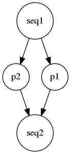

# HPC-DAG Grammar:
Auteur : Houssam-Eddine Zahaf


This part of the HPC DAG Analyzer aims to provide a grammar to
describe the hardware architecture and the software stack using the
HPC DAG Model. Please, first overview the architecture and ssytem mode
section of paper authored by Zahaf et el. entitled : **"The HPC DAG
task Model for heterogeneous real-time system"**.

## The hardware description : 
## The software description :


We introduce the different features of our langage by example. 


### Simple example : LL Task model 

First let define a Liu and LayLand task. Therefore the task is a
executed using a single thread, characterized by :

- **C:**  The task worst case execution time 
- **D:**  The task deadline
- **T:**  The task period, the time duration between to activations of the same 
- **PC:** The task preemtion cost, which is the cost to account, if this task is preempted


Each task definition is considered as a Graph, task **tau** can be defined as follows:

```c
Graph tau(T=50,D=40);	
```


In this example, we define task tau, with a period of 50ms, and a deadline of 40ms.  
To define the task execution time, and preemption cost we define *Compute Nodes* as follows : 

```c
Node dd(C=4);
``` 

In the example above, we defined a compute Node **dd** having an
execution time that is equal to 4ms. To assign this node to the task
**tau**, the relation has to be defined as follows: 

```c
tau={dd;};
``` 

This is equivalent of defining a periodic Liu and Layland task, having
a period of 50 ms, a deadline of 40 ms, and worst case execution time
of 4 ms.

Further, the preemption cost may be defined using the keyword *PC* in
the node declaration, as well as the task TAG is a heterogeneous
architecture is considered. For example:

```c
Node dd(C=4, PC=3, TAG=GPU);
``` 

defines that node **dd** has a preemption cost of 3 ms and can only
execute within a GPU node. If **PC** is not explicitly mentioned, it
is considered as equal to **0**. If the **TAG** is not specified, it
is considered as the default **TAG**.


### A parallel task example using directed acyclic graphs

The user may want to express parallelization and more complex
execution patterns than those of LL model. Here we provide a new
example.


Let tau be a task compound of a sequential thread **seq1**, two
parallel threads **p1** and **p2** to join back a sequential thread
**seq2** as described in the following Figure 


<!--  -->

<div style="text-align:center"></div>


The user may visualize the resulted task by calling using the keyword
**generate**. As the task in this first example is simple, we would
